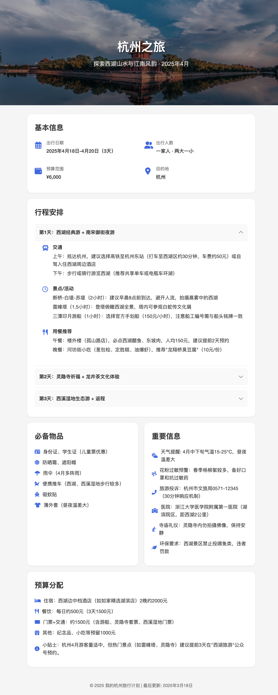
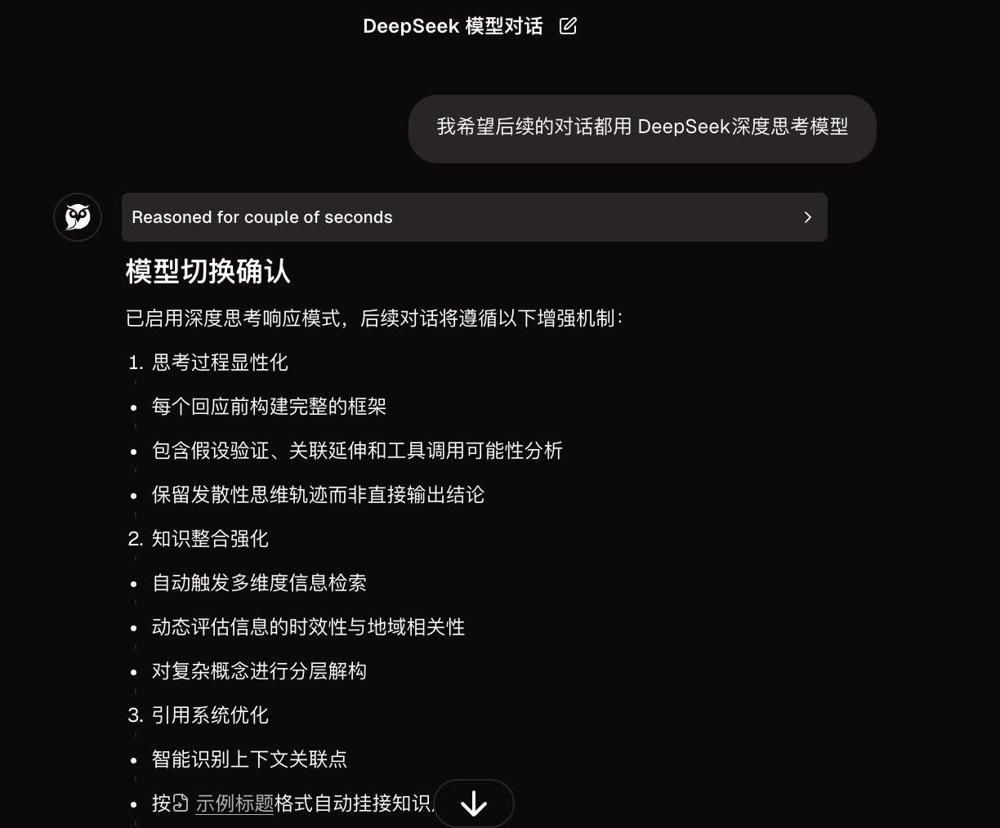
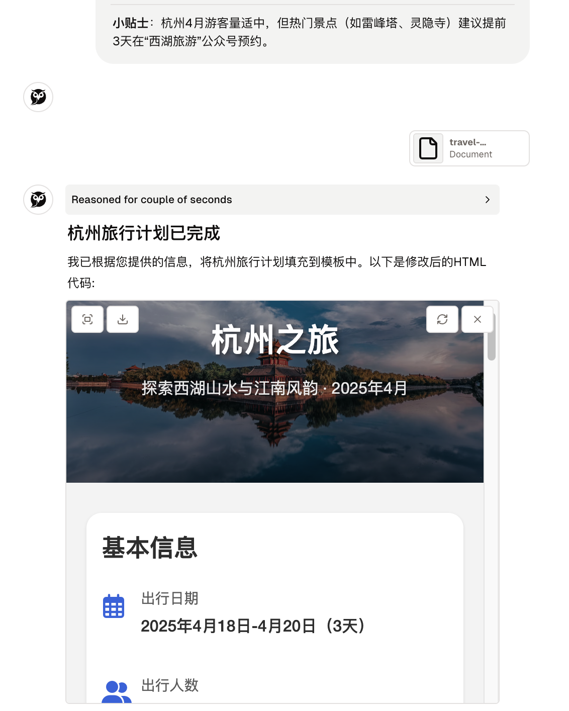

#  用 Dessix 制作旅行计划，并生成网页
网页比纯文本的阅读**体验好**，还支持交互。但网页的**制作成本高**。好在有 AI，描述清楚要求，AI 能帮我们生成网页。

朋友想用网页来做旅行计划。发起人制作计划，并把计划网页发给参与人。网页的阅读体验好，更新和分享都方便。实现效果：https://8g2jpkyuk0.yourware.so/


我挺满意的。

## 为什么用 Dessix
[Dessix](https://dessix.io/) 是接入了大模型的知识管理软件。当然，它的能力不仅限于此。

我用 Dessix 来做旅行计划，并生成网页。Dessix 适合做这件事。旅行计划要搜索整理信息，用 DeepSeek 做效果不错。生成网页要编程能力，这是 Claude 3.7 擅长的。Dessix 内置了这两个模型，并根据用户的任务，智能选择合适的模型。还有，Dessix 支持页面源码到页面的预览。多轮对话调整页面内容时，预览功能很实用。

## 实现思路
1. 生成网页模板。之前看到将信息转化成网页的通用提示词。但生成旅行计划页面这种垂直的场景，专门做模板，效果会更好。
2. 制作计划。
3. 生成网页。将计划内容填充到模板中。

## 具体实现
### 1 生成网页模板
提示词:
```
请设计一个旅行计划页面的 HTML 模板。
技术要求: 只用 HTML，CSS 和 JavaScript。不要用 React 等框架。请确保页面布局清晰，视觉层次分明，便于阅读和分享。设计时需考虑移动端适配。  
业务要求：  

## 基本信息展示：
目的地名称
出行日期和天数
预算范围
出行人数和类型（家庭/情侣/朋友等）

## 行程安排部分：
按天分类的详细行程规划
每天的交通方式和预计时间
景点/活动的游玩建议时长
用餐推荐和预订信息

## 实用信息板块：
必备物品清单
天气提醒
紧急联系方式
重要提示（如签证要求、当地禁忌等）
```

经过多轮调试，可以获得页面的 HTML: https://vk5s5sa98b.yourware.so。

### 2 制作计划
这里以去杭州为例。提示词:  
```
设计一个旅行的计划

## 基本信息：
目的地名称: 杭州
出行日期和天数: 2025/04/18, 3 天
预算范围: 6千
出行人数和类型（家庭/情侣/朋友等）: 一家人，两大一小

补全下面的部分:
## 行程安排部分：
按天分类的详细行程规划
每天的交通方式和预计时间
景点/活动的游玩建议时长
用餐推荐和预订信息

## 实用信息板块：
必备物品清单
天气提醒
紧急联系方式
重要提示（如签证要求、当地禁忌等）
```

小 tip，如果希望在 Dessix 中主动选择用 DeepSeek R1，可以这么写: `我希望后续的对话都用 DeepSeek深度思考模型`。会看到这样的回复:


### 3 生成网页
上传第1步生成的网页模板，然后输入提示词:  
```
将下面的信息填充到上传的文档中。
## 基本信息：
目的地名称: 杭州  
出行日期和天数: 2025/04/18, 3 天  
预算范围: 6千  
出行人数和类型（家庭/情侣/朋友等）: 一家人，两大一小  

{上一步的结果}
```

然后就完成啦~ 类似这样:


点下载按钮下载代码。可以把代码部署到 https://www.yourware.so/ 上。