# 小雅

元宝生成的。Prompt:
```
帮我画一张图片：垂下头嫣然一笑，风格是人像摄影，比例是1:1
```

<div style="display: flex; flex-wrap: wrap;">
  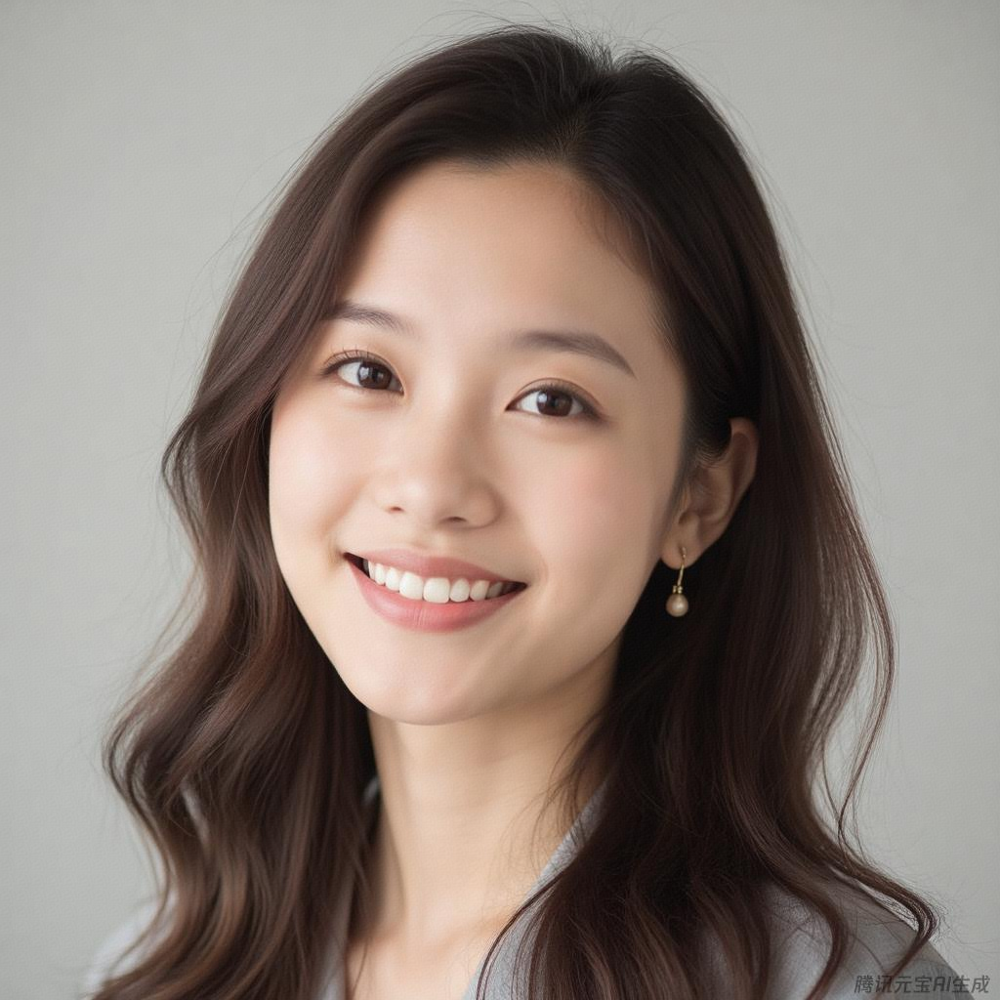
  
  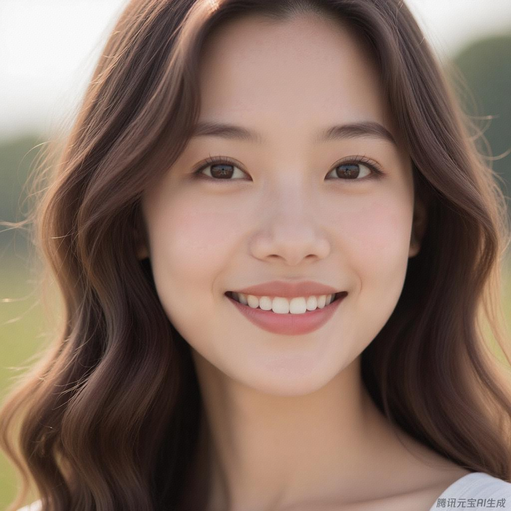
  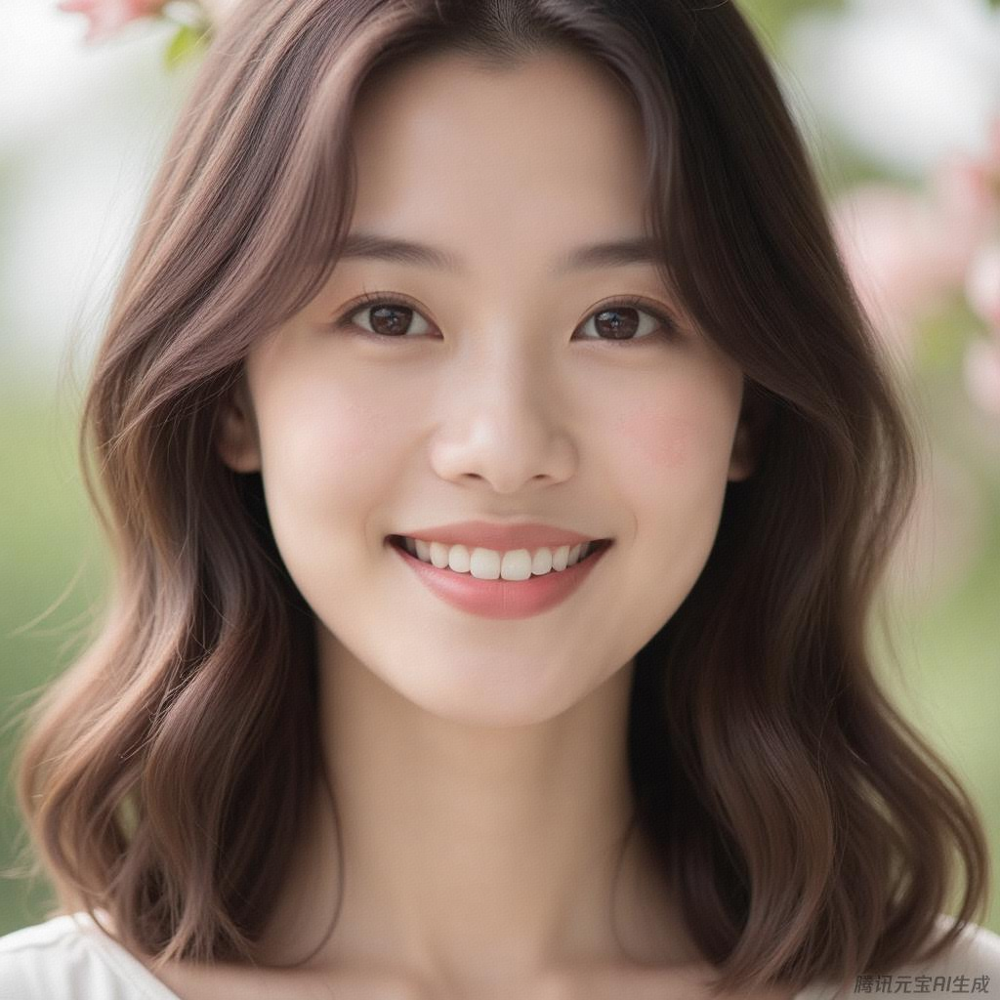
</div>

## 写真
用豆包的 AI 写真功能做的。

<div style="display: flex; flex-wrap: wrap;">
  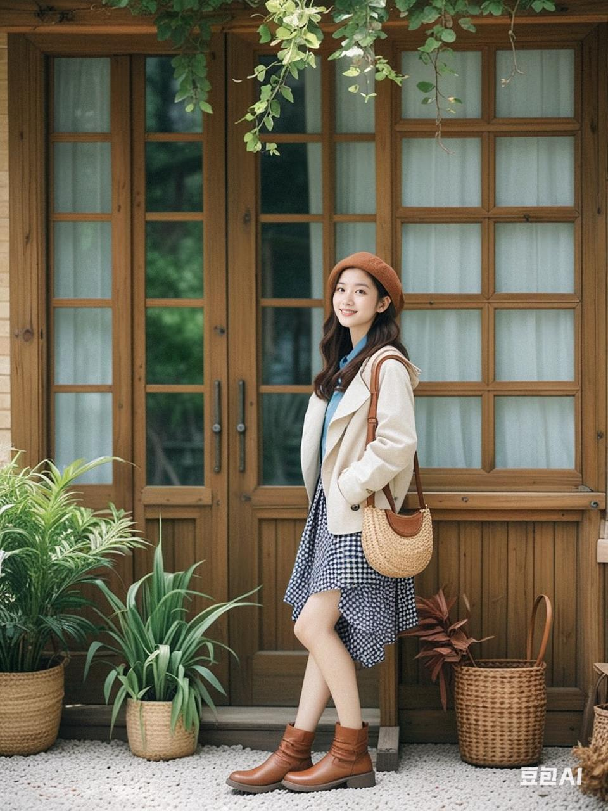
  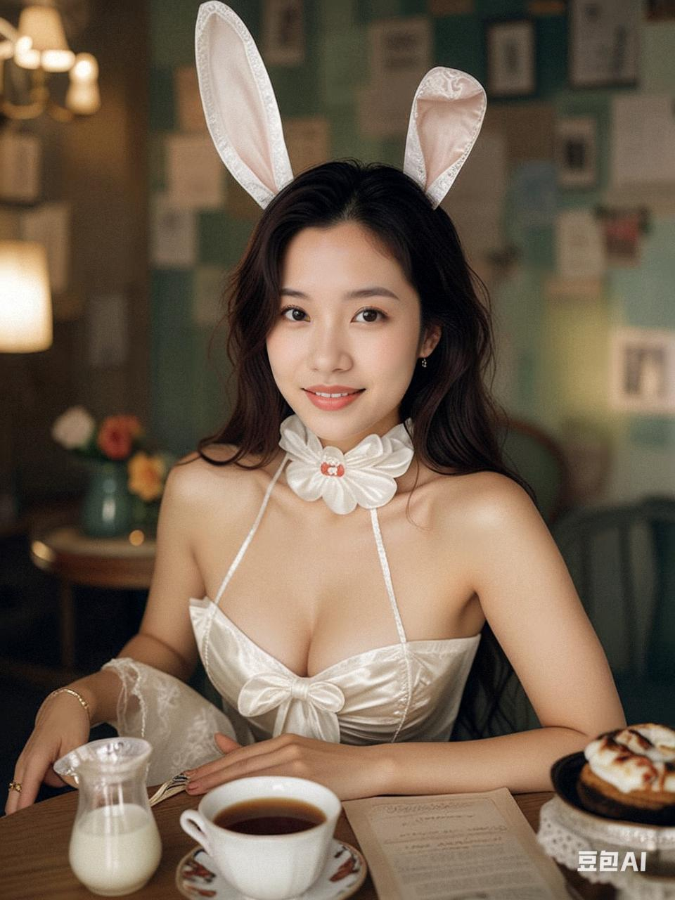
  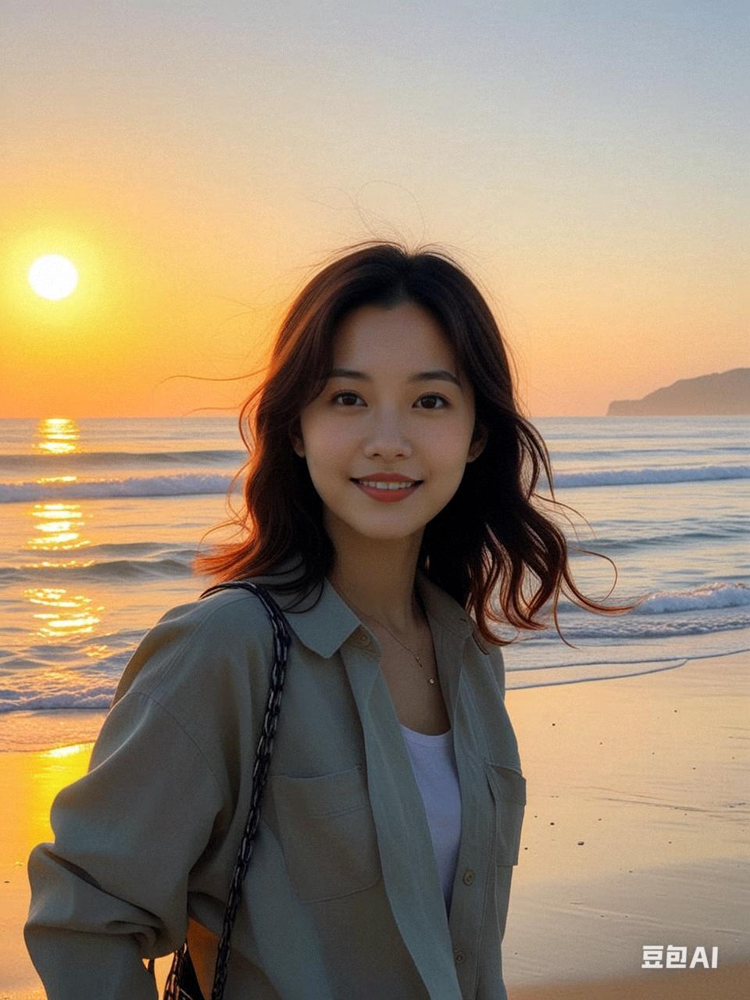
  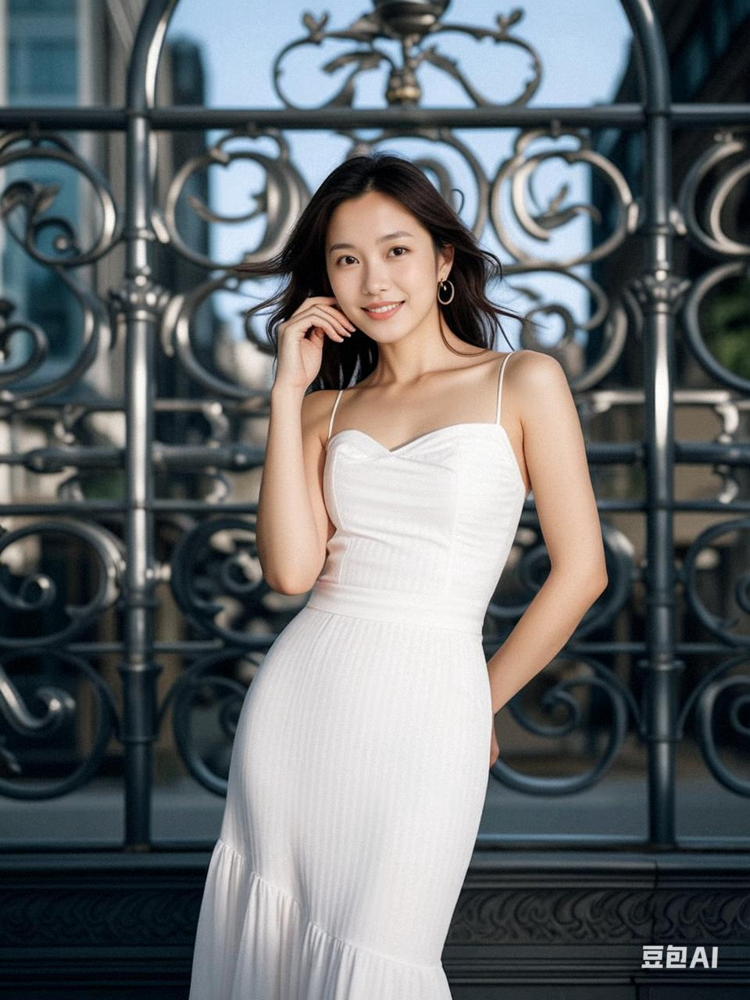
  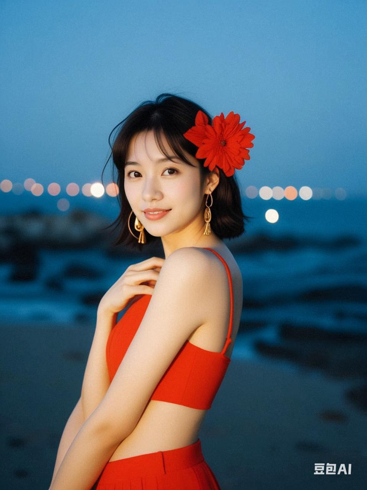
  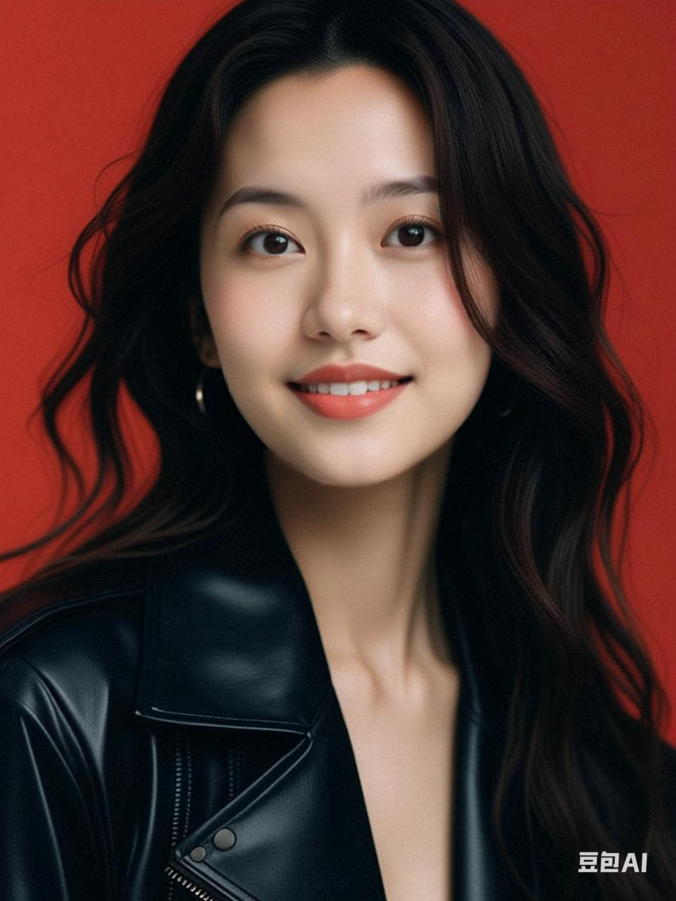
  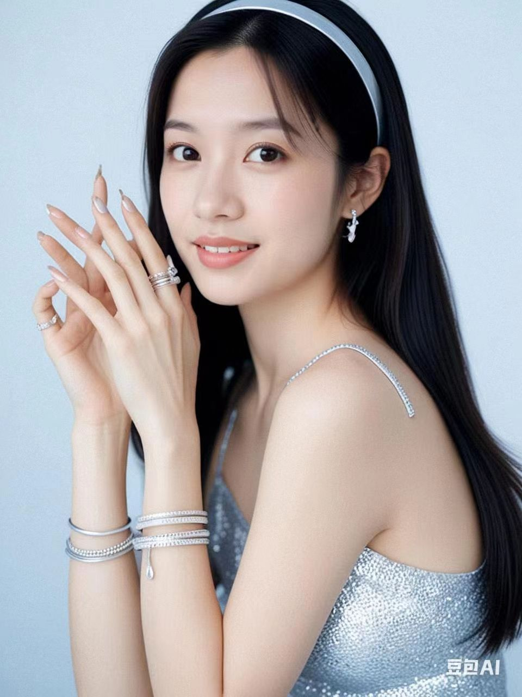
  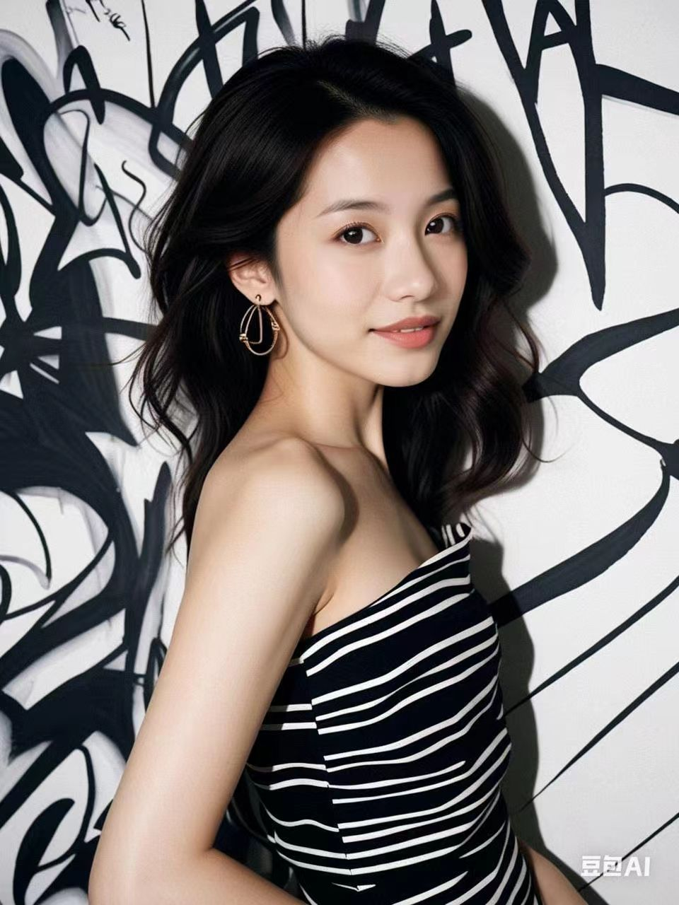
  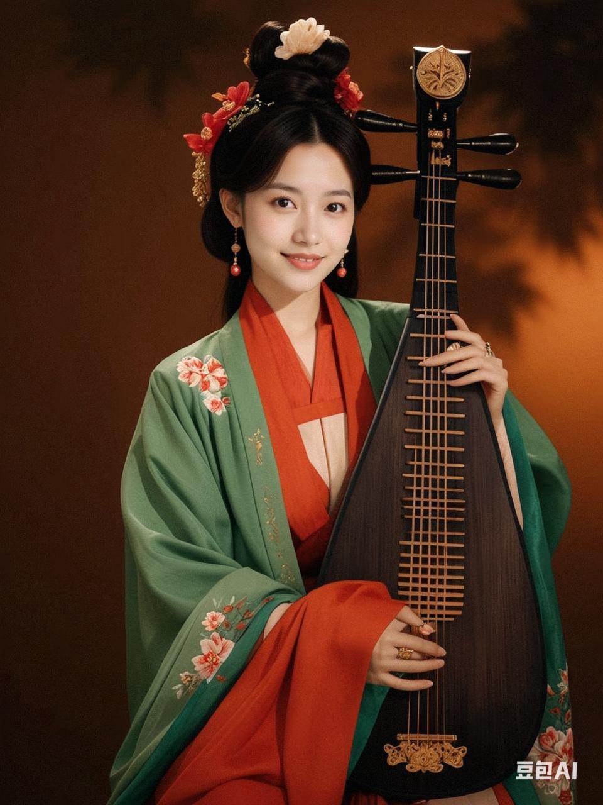
</div>

Prompt:
1. 夜晚，海滩，大海，女人，黑发，红花头饰，金耳环，红色上衣，细肩带，自信姿势，夏日，放松，远光灯，特写，胶片滤镜
2. 在古典的咖啡馆，穿着湿透的兔女郎装
3. 一位酷飒的女生，身穿黑色皮衣，微卷的头发，上半身，红色背景，超细节皮肤质感，工作室照明，专注于面部，高质量，杰作，高分辨率，超细节，超真实，8k
4. 穿着白色连衣裙，站在一个城市街道上，背景中有金属格栅。她的姿态优雅，似乎在微风中轻轻摆动裙子，一只手自然地放在身旁，另一只手轻轻抚摸着脸颊，脚步轻盈，整体风格充满经典好莱坞的魅力和优雅。
5. 年轻女子、木甲板、质朴的木结构、米色夹克、蓝色衬衫、黑白格子裙、白色袜子、棕色鞋子、针织包、长长的黑色波浪发、棕色帽子、木制建筑、小门廊、柳条篮、汉字、绿色植物、阔叶、柳条篮、干叶、玻璃门、白色窗帘、舒适的室内、宁静的氛围、乡村环境、自然、简朴、平静、放松。
6. 漫步在夕阳下的沙滩上。
7. 传统服饰，东亚风格，中国古代时尚，飘逸的服装，多层长袍，绿色衣袖，红色布料，花卉刺绣，牡丹，丝绸花朵，金色链条，发饰，传统弦乐器，琵琶，木色，复杂精美的装饰，肤色白皙，东亚血统，黑色头发，复杂的高髻，艺术专注，从容的神态，电影感，光影。
<!-- 8. 兔女郎装，在街边 -->


